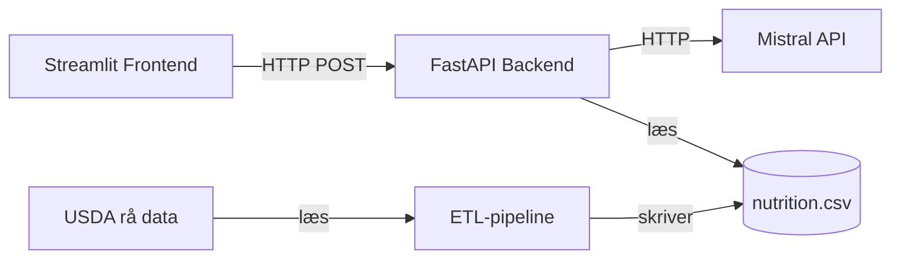

# Recipe Analyzer

En applikation der analyserer opskrifter og beregner kalorier samt makronæringsstoffer ved hjælp af en LLM og USDA's ernæringsdatabase.

## Arkitektur

- **Frontend:** Streamlit (port 8501)
- **Backend:** FastAPI (port 8000)
- **LLM:** Mistral API (parser opskrift + matcher mod database)
- **Data:** USDA Foundation Food

## Kom i gang

### 1. Opret `.env`

```bash
cp .env.example .env
```

Udfyld `MISTRAL_API_KEY` med din egen nøgle fra [console.mistral.ai](https://console.mistral.ai/).

### 2. Start med Docker Compose

```bash
docker compose up
```

Åbn derefter:
- Frontend: http://localhost:8501
- Backend API-docs: http://localhost:8000/docs

### 3. Stop

```bash
docker compose down
```

## Lokal udvikling (uden Docker)

```bash
python -m venv .venv
source .venv/Scripts/activate     # Windows: .venv\Scripts\activate
pip install -r backend/requirements-dev.txt
pip install -r frontend/requirements.txt
```

Start backend og frontend i hver sin terminal:

```bash
# Terminal 1
cd backend
uvicorn app.main:app --reload

# Terminal 2
streamlit run frontend/app.py
```

## Tests og kodekvalitet

```bash
pytest                    # kør unit tests
mypy backend/app          # type checks
ruff check backend/       # linting
```

## Genbyg ernæringsdatabase

Hvis du vil genbygge `data/nutrition.csv` fra rå USDA-data:

1. Download Foundation Foods (CSV) fra [USDA FoodData Central](https://fdc.nal.usda.gov/download-datasets.html)
2. Udpak til `data/raw_usda/`
3. Kør:

```bash
python build_nutrition_data.py
```

## Projektstruktur

```
recipe-analyzer/
├── backend/              # FastAPI-service
│   ├── app/              # main.py, models, llm_client, nutrition, analysis
│   └── tests/            # unit tests
├── frontend/             # Streamlit-service
├── data/
│   └── nutrition.csv     # renset USDA-dataset
├── build_nutrition_data.py   # ETL-pipeline
├── docker-compose.yml
└── pyproject.toml        # ruff, mypy, pytest config
```



